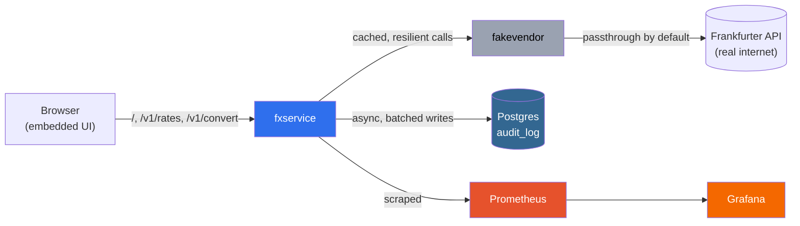

# FX Rate Service

A Go HTTP service that sits in front of the free
[Frankfurter](https://api.frankfurter.app) exchange rate API — the kind
of thing a BNPL checkout would call to display prices in USD, CAD, and
other currencies. Built in six phases: foundation, resilience (retries,
circuit breaker, bulkhead), caching (stale-serving), observability
(Prometheus/Grafana), an async Postgres audit log, and finally a demo UI
with CI-built, publicly-hosted images.

## Run it (one command, nothing but Docker required)

```bash
docker compose up -d
```

Then open **http://localhost:8080**. No Go toolchain, no `.env` file, no
local build — the default `docker-compose.yml` pulls pre-built,
multi-arch (amd64 + arm64) images from GHCR, so this works unmodified on
Mac (Intel or Apple Silicon) and Linux.

| Service | URL | What it's for |
|---|---|---|
| **fxservice** | http://localhost:8080 | The UI, and the API itself (`/v1/rates`, `/v1/convert`) |
| fakevendor | http://localhost:9090 | Toggleable vendor proxy — `POST /admin/mode?mode=off\|error\|slow` |
| Prometheus | http://localhost:9091 | Metrics + the 5 alert rules |
| Grafana | http://localhost:3000 | Pre-loaded dashboard, anonymous viewer access, no login |
| Postgres | `localhost:5432` | Audit log — `make db-shell` / `make audit-tail` |

## 30-second demo

1. Open **http://localhost:8080** — use the **Convert** form (e.g. `USD` → `CAD`, `100.00`). First call shows an `X-Cache: MISS` badge; call it again and watch it flip to `HIT`.
2. Break the vendor live, from your terminal, with the UI still open: `make chaos-on`. Convert again — after a few failures the breaker trips and you'll see a `CIRCUIT_OPEN` error. Wait ~30s for the cache's fresh TTL to lapse and the breaker's retry window, then convert once more: you'll see an `X-Cache: STALE` badge — the last known-good rate, clearly labeled, instead of an outright failure. `make chaos-off` restores it.
3. Kill the database with everything else still running: `make db-down`. The UI keeps working exactly as before — check `curl http://localhost:8080/ready`, which stays `200` and just reports `postgres: down` in the body. `make db-up` brings it back; nothing needs restarting.

```bash
make chaos-on    # inject vendor failures
make chaos-off   # restore
make db-down     # stop postgres
make db-up       # bring it back
make audit-tail  # see the last 10 audited requests
make down        # tear the whole stack down
```

## Architecture



fxservice is the only service callers (or the browser) ever talk to. It
embeds the UI, calls fakevendor (which either passes through to the real
Frankfurter API or injects failures on demand), writes every request to
Postgres asynchronously, and exposes Prometheus metrics that Grafana
visualizes.

---

Everything below this point is the detailed design writeup carried
through all six phases — the reasoning behind every tradeoff, every
config default, and every "why not X instead." Read "Project layout"
onward for that.

## Project layout

```
cmd/fxservice/                    entrypoint: wires config + server, handles SIGTERM/SIGINT
cmd/fakevendor/                   toggleable reverse proxy in front of the real vendor, for chaos/stale-cache demos
internal/config/                  env-var driven config with defaults (only package that reads os.Getenv)
internal/httpapi/                 routes, middleware (request id, logging, rate limit, metrics), handlers
internal/fxvendor/frankfurter/    Frankfurter HTTP client — ONE HTTP attempt, nothing more
internal/fxvendor/resilience/     wraps the vendor client: circuit breaker -> bulkhead -> retry (see ordering below)
internal/fxvendor/ratescache/     wraps resilience.Client: serves fresh/stale from cache, singleflight, negative cache
internal/cache/                   Cache interface + in-memory LRU implementation (swappable for Redis later)
internal/ratelimit/               per-client-IP inbound token-bucket rate limiting middleware
internal/metrics/                 every Prometheus metric this service exports, plus hook-shaped methods
internal/audit/                   async audit log: Record, the batching Writer, pgx Sink, embedded schema
internal/money/                   decimal-safe parsing and rounding (shopspring/decimal, no float64)
internal/webui/                   embeds and serves the single-page demo UI (go:embed, no build step)
Dockerfile                        multi-stage build -> distroless/static, non-root
cmd/fakevendor/Dockerfile         same pattern for the demo proxy
.github/workflows/                CI: vet + test, then multi-arch build & push to GHCR
docker-compose.yml                default stack: pulls images from GHCR (fxservice + fakevendor + prometheus + grafana + postgres)
docker-compose.build.yml          override: build fxservice/fakevendor from local source instead of pulling
deploy/prometheus/                scrape config + alert rules (loaded directly, no Alertmanager)
deploy/grafana/                   datasource + dashboard provisioning, anonymous-viewer config

Note on the vendor URL: Frankfurter migrated its API mid-build —
`api.frankfurter.app` now 301-redirects to `api.frankfurter.dev/v1`. Go's
`http.Client` follows redirects by default so the old URL kept "working"
anyway, just paying for an invisible extra DNS+TLS+request round trip on
every vendor call. `FRANKFURTER_BASE_URL`'s default points at the
canonical URL to drop that tax. This was caught because
`httputil.ReverseProxy` (used in `cmd/fakevendor`) does *not* follow
redirects — a good reminder that a reverse proxy and a client library can
silently disagree about redirect handling.
```

## Endpoints

| Method | Path | Description |
|---|---|---|
| GET | `/` | Single-page demo UI (embedded, see "Demo UI" below) |
| GET | `/v1/rates/{base}?symbols=USD,CAD` | Latest rates for a base currency |
| GET | `/v1/convert?from=USD&to=CAD&amount=100.00` | Convert an amount between two currencies |
| GET | `/health` | Liveness probe — always 200 if the process is up |
| GET | `/ready` | Readiness probe — always 200; body reports circuit breaker state, cache stats, and Postgres reachability (see below) |
| GET | `/metrics` | Prometheus metrics — see "Observability" below for the full list |

`/v1/rates` and `/v1/convert` responses now also carry an `X-Cache: HIT
\| MISS \| STALE` header and `"stale"` / `"date"` / `"age_seconds"`
fields in the JSON body — see "The rates cache" below. Every call to
these two endpoints is also recorded, async, to a Postgres audit log —
see "Async audit log" below.

All errors return the same JSON shape:

```json
{"error": {"code": "INVALID_CURRENCY", "message": "..."}}
```

Error codes: `STALE_DATA_UNAVAILABLE` (503 — the only cached entry we
have is older than `CACHE_STALE_MAX_AGE` and the vendor call to refresh
it failed), `CIRCUIT_OPEN` (503 — breaker is open and there was no
cached fallback at all), `RATE_LIMITED` (429, with a `Retry-After`
header).

## Demo UI

`internal/webui/static/index.html` is a single static file — plain
HTML/CSS/vanilla JS, no React, no Node, no build step. It's embedded
directly into the `fxservice` binary with `//go:embed` and served at `/`
by the same process that serves the API, which buys two things for
free:

- **No extra container.** The UI isn't a separate service in
  `docker-compose.yml` — it's just another route on `fxservice`.
- **No CORS configuration anywhere.** The page's own `fetch()` calls to
  `/v1/rates/...` and `/v1/convert` are same-origin, because the page and
  the API it calls are served by the exact same process on the exact
  same port. There's no cross-origin request to configure around in the
  first place.

Two forms — **Get rates** (base + optional symbols) and **Convert**
(from/to/amount) — each call the real API and render:
- An **X-Cache** badge (`HIT` / `MISS` / `STALE`, color-coded) read
  straight from the response header.
- A **STALE DATA** badge when the body's `"stale"` field is true, plus
  the reported age in seconds — the same signals described in "The rates
  cache" below, just made visible without opening dev tools.
- JSON errors rendered as a labeled box (error code, HTTP status, and a
  short human-readable description) rather than a raw JSON dump — see
  `ERROR_LABELS` in the page's own script for the code→label mapping,
  which intentionally falls back to showing the raw code for anything
  not in that list, so a new server-side error code still renders
  something sensible instead of breaking the page.

Light and dark mode via `prefers-color-scheme` — nothing fancier than
that; this is a demo surface for exercising the API, not a product UI.
A footer links to Grafana, Prometheus, `/metrics`, and `/ready`.

## How a call to the vendor is wrapped, and why in this order

```
inbound request
  -> rate limiter        (protects US from too much inbound load)
       -> handler
            -> circuit breaker   (is the vendor even worth trying right now?)
                 -> bulkhead      (how many of "trying it" are allowed at once?)
                      -> retry     (keep trying this one call, within a budget)
                           -> single HTTP attempt
```

- **Rate limiter is outermost**, at the HTTP middleware layer. It has
  nothing to do with the vendor — it protects us from our own callers,
  so it should reject before we spend a goroutine on anything else.
- **Circuit breaker wraps the retry loop, not a single attempt.** The
  breaker answers "is the vendor healthy right now," which is a judgment
  over many calls — so one `Client.Latest()` call (which may retry
  internally several times) counts as exactly one success/failure data
  point to the breaker. If retries happened *outside* the breaker, one
  slow call that retries 3 times would look like 3 separate failures to
  the breaker's trip-ratio math and over-weight it.
- **Bulkhead sits inside the breaker, around the retry loop.** The
  breaker gates it: when the breaker is open we return immediately and
  never touch the concurrency semaphore at all — a tripped breaker should
  cost us nothing, not even a bulkhead slot.
- **Retry is innermost.** It's the only layer that actually knows about
  individual network attempts: per-attempt timeout, which errors are
  worth retrying, backoff between attempts.

Short version for an interview: *rate limit protects us from our
callers, the breaker decides whether the vendor is worth calling at all,
the bulkhead caps how much of "calling it" we allow concurrently, and
retry is the only layer that knows about individual network attempts.*

## Timeouts

Two levels, both derived from the inbound request's own context so a
client disconnect or cancellation stops vendor calls immediately:

- **Per-attempt timeout** (`UPSTREAM_TIMEOUT`): bounds a single HTTP
  attempt to the vendor.
- **Overall call budget** (derived, not independently configured):
  `RETRY_MAX_ATTEMPTS * (UPSTREAM_TIMEOUT + RETRY_MAX_DELAY)` — enough
  for every attempt to use its full timeout back-to-back plus the
  backoff sleeps between them. It's derived so it can never accidentally
  be set lower than what the configured attempts need.

## Retry

Retries only make sense for failures that might not recur immediately:
transport errors (timeouts, connection refused), 429, and 5xx. A 4xx
like a bad currency code fails identically every time, so retrying it
just adds latency to a response we already know is an error — we don't
retry those.

Backoff uses **full jitter**: each retry waits a random duration between
0 and an exponentially growing cap, rather than a fixed exponential
delay. This spreads retries out across time instead of having every
caller retry in lockstep right when an outage ends (the "thundering
herd" problem). If the vendor sends a `Retry-After` header (typically
with a 429), we honor that over our own backoff guess — an explicit
vendor instruction overrides our estimate, uncapped by our own
`RETRY_MAX_DELAY` (that cap only bounds our own guesses, not the
vendor's explicit instruction).

## Circuit breaker

Uses [`sony/gobreaker/v2`](https://github.com/sony/gobreaker). Chosen
over hand-rolling one because it's small, well-used in production Go
services, and its generic `CircuitBreaker[T]` lets us wrap our typed
`*frankfurter.LatestRates` result directly — no `interface{}` casting.
Its `ReadyToTrip(counts)` hook also gives us full control over the trip
policy instead of a rigid built-in one.

Trip policy: requires at least `BREAKER_FAILURE_THRESHOLD` calls before
it will even consider tripping (so one or two cold-start failures don't
open it), then trips if at least half of those calls failed. Once open,
it stays open for `BREAKER_OPEN_DURATION`, then allows a few trial
requests through (half-open) — if those succeed it closes, if they fail
it reopens.

Every state transition is logged with old and new state:

```json
{"msg":"circuit_breaker_state_change","breaker":"frankfurter","from":"closed","to":"open"}
```

When open, calls fail in well under a millisecond with `503
CIRCUIT_OPEN` — the vendor is never touched.

## Bulkhead and vendor transport tuning

`VENDOR_MAX_CONCURRENT_CALLS` caps how many calls to Frankfurter can be
in flight at once, independent of inbound request volume — a ship-design
term: a bulkhead is a partition that stops one flooded compartment from
sinking the whole vessel. Without this cap, a slow vendor means every
inbound request piles up a blocked goroutine and a held connection,
until we exhaust one or the other.

The vendor's `http.Transport` is also tuned
(`VENDOR_MAX_IDLE_CONNS`, `VENDOR_MAX_IDLE_CONNS_PER_HOST`,
`VENDOR_IDLE_CONN_TIMEOUT`), and response bodies are capped at
`VENDOR_MAX_RESPONSE_BYTES` so a huge or malformed response can't blow
our memory.

## Inbound rate limiting

Per-client-IP token bucket (`golang.org/x/time/rate`), keyed by the
first address in `X-Forwarded-For` (if present — a load balancer/ingress
is assumed to set this and strip any caller-supplied value) or
`RemoteAddr` otherwise. `RATE_LIMIT_RPS` is the sustained rate,
`RATE_LIMIT_BURST` absorbs legitimate bursty traffic. A background sweep
evicts IPs that haven't been seen in a while, so the per-IP map doesn't
grow forever. `/health`, `/ready`, and `/metrics` are never rate limited
— those are operational traffic (kubelet probes, Prometheus scrapes),
not caller traffic.

## The rates cache

`internal/fxvendor/ratescache` sits *outside* the breaker/bulkhead/retry
stack, not inside it — those layers answer "how do we safely make one
call to the vendor," the cache layer answers "do we even need to make
that call right now, and if it fails, do we have something safe to fall
back to."

```
inbound request
  -> ratescache   (serve from cache if fresh; on miss/refresh, dedupe
                    concurrent callers; on vendor failure, fall back to
                    a still-valid stale entry)
       -> resilience.Client   (breaker -> bulkhead -> retry -> attempt)
```

### Cache key normalization and why amount is never in the key

The key is the base currency plus the normalized symbol set: upper-cased,
deduplicated, sorted. `base=USD&symbols=CAD,EUR` and
`base=usd&symbols=eur,cad` hit the exact same entry (`internal/cache/key.go`).

Critically, **`/v1/convert`'s `amount` is never part of the cache key.**
We cache the *rate*, not a converted result — `ConvertHandler` calls the
same `Latest()` as `RatesHandler` with `symbols=[to]`, gets back a rate,
and does the decimal multiplication locally with `internal/money` on
every request. One cached rate entry serves an unlimited number of
convert requests for any amount, instead of caching per-amount (which
would barely ever hit, since checkout amounts are rarely identical).

### Two TTLs, and why these particular defaults

Frankfurter (ECB data) publishes one new rate per TARGET business day
and nothing changes over weekends or holidays — so the right defaults
here are chosen against that cadence, not typical "web API" freshness:

- **`CACHE_FRESH_TTL` (default `1h`)**: while an entry's age is under
  this, we serve it directly with zero vendor calls (`X-Cache: HIT`).
  There's no benefit to polling more often than this since the rate
  won't have moved, but it's short enough that an intra-day vendor
  correction, or our own restart, doesn't pin us to very old "fresh"
  data for too long.
- **`CACHE_STALE_MAX_AGE` (default `48h`)**: once an entry is past its
  fresh TTL, we try the vendor again; if that call fails for *any*
  reason — timeout, 5xx, or the circuit breaker being open — we fall
  back to the existing entry as long as its age is still under this
  ceiling (`X-Cache: STALE`). 48h covers a normal weekend (serving
  Friday's close through Saturday/Sunday is *correct*, not degraded,
  since the rate genuinely hasn't changed) plus one full extra business
  day of vendor-outage buffer. Past this ceiling we refuse to serve the
  rate at all — see the fintech-correctness note below.

### Fintech correctness: visible staleness, and a hard refusal past max age

This is fintech, so a rate can't silently drift stale on a payment
screen. Three things enforce that:

1. **`X-Cache` response header**: `HIT` (fresh, from cache, no vendor
   call), `MISS` (required a vendor call — cold cache or past fresh TTL
   and the vendor answered), or `STALE` (vendor call failed, served from
   an aging-but-still-valid cache entry).
2. **Response body fields**: every `/v1/rates` and `/v1/convert` response
   includes `"stale": true/false`, `"date"` (the vendor's own as-of
   date, not our fetch time), and `"age_seconds"`. Headers can be
   stripped by something in between us and the caller; these fields
   can't, so a caller that only inspects the JSON body — not headers —
   still can't miss that data is stale.
3. **Hard refusal past `CACHE_STALE_MAX_AGE`**: if the cached entry is
   older than this and the vendor call to refresh it fails, we return
   `503 STALE_DATA_UNAVAILABLE` rather than silently serving a
   two-day-old FX rate. Loud failure beats silent incorrectness here.

`Cache-Control` is also set per response: `public, max-age=<fresh
seconds remaining>` on a HIT, `public, max-age=0` on a MISS (freshly
fetched, but we're not promising how long it stays valid from the
caller's clock), and `no-store` on a STALE response — degraded data
shouldn't get cached further downstream and potentially extend how
stale a client's own view becomes.

### Singleflight: protecting the vendor (and the breaker) from a thundering herd

`golang.org/x/sync/singleflight` collapses concurrent identical calls
for the same cache key into exactly one in-flight vendor call; every
other caller waits on that one result instead of making their own.

This matters for two different reasons:

- **Protects the vendor.** Without it, 100 concurrent requests landing
  on a cold cache (right after a restart, or right when a popular key's
  fresh TTL lapses under load) would each independently call Frankfurter
  — the textbook thundering herd. With singleflight it's always exactly
  1 vendor call no matter how many waiters there are.
- **Protects the circuit breaker's own math.** The breaker counts one
  `resilience.Client.Latest()` call as one success/failure data point.
  Without singleflight, 100 concurrent misses would mean 100 individual
  breaker data points for what is really one underlying event (the
  vendor being slow or down just once) — that swamps the breaker's
  failure-ratio calculation with duplicate signal. Collapsing them to 1
  call keeps the breaker's view of "is the vendor healthy" accurate.

### LRU capacity and negative caching

`CACHE_MAX_ENTRIES` bounds the cache to a fixed number of distinct
base+symbols combinations, evicting least-recently-used entries beyond
that — so memory can't grow without bound as new currency-pair
combinations accumulate over the life of a long-running pod.

A **negative cache** remembers "the vendor said this base/symbols
combination doesn't exist" (a 404) for `CACHE_NEGATIVE_TTL` (default
`60s`) — short, and deliberately much shorter than the rate TTLs above,
because a vendor rejection is a different *kind* of fact than a
successful rate: a currency Frankfurter adds support for later shouldn't
stay blocked for as long as a normal fresh-rate TTL would imply. Without
this, someone (or something automated) repeatedly querying an invalid
currency code would cost a vendor round-trip on every single request.

### In-memory cache vs. Redis: the tradeoff when running multiple pods

The `Cache` interface (`internal/cache/cache.go`) exists specifically so
a Redis-backed implementation could be swapped in later without touching
`ratescache`, handlers, or anything above it — only `main.go`'s wiring
changes. We ship an in-memory LRU for this phase. The tradeoff, with
multiple pods:

**In-memory (what we ship):** each pod holds its own independent cache.
- A synchronized cold start (e.g. a rolling deploy) can produce up to N
  independent vendor calls for the same key instead of 1, where N is the
  pod count. Given Frankfurter updates once a day, this is a bounded,
  cheap cost — not a real scaling problem at typical pod counts.
- Hit ratio is a per-pod number; a freshly scaled-up pod starts at 0%
  and dashboards need to look at this per-pod or as a distribution,
  not assume one fleet-wide number.
- Pods can briefly disagree on exact "as of" timing if their fetches
  landed at different moments — a minor, accepted consistency gap for a
  checkout price.
- The real upside: zero extra network hop, zero extra infrastructure
  dependency, and **isolated blast radius** — if the cache layer itself
  has a bug or breaks, it breaks one pod, not the whole fleet
  simultaneously.

**Redis (shared cache):** one vendor call warms every pod, hit ratio is
a single fleet-wide number, all pods agree on the same "as of" date. The
cost is a network hop on every cache read (still far cheaper than
calling Frankfurter), one more operational dependency to run and
monitor, and a new **shared-fate failure mode** — if Redis has a bad
day, every pod's cache layer has a bad day at the same time, which is
exactly the kind of synchronized failure the circuit breaker and
bulkhead (phase 2) were built to avoid at the vendor layer.

Given Frankfurter's once-a-day update cadence, in-memory's per-pod
vendor-call overhead is negligible — this is the right default here.
Redis becomes the right call once vendor call volume/cost is the
dominant concern, or cross-pod consistency genuinely matters for a
specific feature, not as a default upgrade.

## `/ready`: why it always returns 200, even with the breaker open

This is the single most interview-relevant design decision in this
phase, so it's worth stating precisely:

**`/ready` always returns HTTP 200 — unchanged from phase 2, and if
anything more clearly correct now that caching exists.** The response
body reports circuit breaker state and cache stats for humans and
dashboards:

```json
{
  "status": "ready",
  "dependencies": {"frankfurter": {"circuit_breaker": "open"}},
  "cache": {"entries": 42, "oldest_entry_age_sec": 1800}
}
```

Kubernetes readiness is a **per-pod** signal that controls whether that
pod receives traffic from the Service. If every pod's readiness depended
on a shared external vendor being reachable, then the moment Frankfurter
has a bad few minutes, every pod in the fleet fails its readiness probe
at roughly the same time and gets pulled from the Service's endpoints
simultaneously — the whole FX service goes to zero available pods, for
every currency, every caller, everywhere. We'd have turned "one vendor
is slow" into "our entire fleet is down," which is strictly worse than
the vendor outage itself, and entirely self-inflicted.

Now that caching exists, a pod with the breaker open can keep serving
correct, clearly-labeled stale rates (`X-Cache: STALE`) right up to
`CACHE_STALE_MAX_AGE` — so "vendor unreachable" even more clearly
doesn't mean "this pod has nothing useful to do." That's the whole point
of this phase, and `/ready` staying green is what lets it actually help:
if readiness failed the instant the breaker opened, Kubernetes would
pull the pod before it ever got to serve the stale data it just built up.

**One edge case worth naming rather than silently handling**: a pod that
is cache-cold (e.g. just started) *and* has its breaker open *and* has
nothing cached at all is arguably "truly not ready." We deliberately do
not fail readiness for this today — the obvious detection (zero cache
entries) is exactly the state every pod is in right after a synchronized
fleet restart, which would reintroduce the same thundering-herd-of-pod-
evictions problem this design avoids everywhere else. We'd rather this
show up as a loud structured log (`stale_data_exceeds_max_age` /
`request_rejected_breaker_open` with an empty cache) and a future
Prometheus alert ("zero servable entries while breaker open") than as
readiness-driven pod eviction logic we might get wrong under exactly the
conditions it's meant to protect against. If you want a hard alert on
breaker-open or a cold-and-broken pod, that's a Prometheus alert on the
breaker-state/cache-entries metrics (now wired — see below), not a 503 on
`/ready`.

## Observability

`internal/metrics` defines every metric this service exports and a set
of `OnXxx` methods shaped to match the hook structs already defined in
`internal/httpapi`, `internal/fxvendor/resilience`,
`internal/fxvendor/ratescache`, `internal/cache`, and `internal/ratelimit`.
Nothing in those packages imports Prometheus — `cmd/fxservice/main.go` is
the only place a `*metrics.Metrics` gets wired into their hook fields, so
metrics stay a pure observer, never a dependency business logic has to
satisfy in tests. All metrics use the `fxservice_` prefix.

### Cardinality, briefly

Every distinct combination of label values on a metric becomes its own
time series that Prometheus stores and indexes until retention expiry. A
label whose values are unbounded or caller-controlled — a raw URL path,
a client IP, a currency code, an amount — means the series count grows
without bound as traffic varies, which is the single most common way to
make a Prometheus instance slow or fall over on memory.

Every label used here is one of: a small fixed **route pattern** (see
below — never the raw requested path), an HTTP **method**, an HTTP
**status class** (`2xx`/`3xx`/`4xx`/`5xx` — coarser than the exact code,
and still bounded either way), or a small fixed **outcome enum** (e.g.
`hit`/`miss`/`stale`/`negative_hit`, or `success`/`error`/`timeout`/`breaker_open`).
**Nothing is ever labeled by client IP, currency code, or amount.**

### Route pattern labeling

`GET /v1/rates/USD`, `GET /v1/rates/CAD`, `GET /v1/rates/EUR`, ... would
each be a distinct raw path — one time series per currency code ever
queried, growing without bound. Instead, `routePattern()` in
`internal/httpapi/middleware.go` maps every request path to one of a
small fixed set (`/v1/rates/{base}`, `/v1/convert`, `/health`, `/ready`,
`/metrics`, or `other`) before it ever reaches a metric label — matching
the same small set of patterns our `http.ServeMux` is registered with.
Ten different currencies queried against `/v1/rates/{base}` produce
exactly one route label value, not ten.

### What's exported

**Inbound HTTP (RED)**
- `fxservice_http_requests_total{method,route,status}` (counter) — status is the `2xx`/`3xx`/`4xx`/`5xx` class
- `fxservice_http_request_duration_seconds{method,route}` (histogram) — status is deliberately NOT a label here, to keep histogram series count down (a histogram multiplies bucket count × label combinations)

**Vendor calls**
- `fxservice_vendor_call_duration_seconds{outcome}` (histogram) — outcome ∈ `success`, `error`, `timeout`, `breaker_open`; measured once per whole `resilience.Client.Latest()` call (which may retry internally), matching how the circuit breaker itself counts one call as one data point (see "How a call to the vendor is wrapped" above)
- `fxservice_vendor_retry_attempts_total` (counter) — total retry attempts, not counting each call's first attempt

**Circuit breaker**
- `fxservice_circuit_breaker_state{breaker="frankfurter"}` (gauge) — `0`=closed, `1`=half-open, `2`=open. A gauge, not a counter: this is "what is the current state," a single value that changes over time, not an event count. Encoding state as a label instead would mean three permanently-present series where only one is ever "current" — more confusing to query than a numeric gauge.

**Cache**
- `fxservice_cache_requests_total{result}` (counter) — result ∈ `hit`, `miss`, `stale`, `negative_hit`
- `fxservice_cache_evictions_total` (counter) — LRU capacity evictions
- `fxservice_cache_entries` (gauge) — sampled every 5s (a point-in-time fact, not an event, so a timer updates it rather than every call site)
- `fxservice_cache_singleflight_shared_total` (counter) — requests that got a result from someone else's in-flight vendor call instead of making their own

**Rate limiting**
- `fxservice_rate_limit_rejections_total` (counter)

**Bulkhead**
- `fxservice_vendor_inflight_calls` (gauge) — current concurrent calls to the vendor

**Build info**
- `fxservice_build_info{version}` (gauge, always `1`) — version as a label is the one deliberate exception to "no per-request labels": this is a single fixed value per process, set once at startup, not something that grows with traffic.

**Audit log (phase 5)**
- `fxservice_audit_queue_depth` (gauge) — sampled every 5s
- `fxservice_audit_records_written_total` / `_dropped_total` (counters)
- `fxservice_audit_write_errors_total` (counter) — a failed batch attempt, retried; not the same as a dropped record
- `fxservice_audit_batch_write_duration_seconds` (histogram)

**Postgres pool (phase 5)** — all sampled every 5s from `pgxpool.Pool.Stat()`
- `fxservice_pg_pool_conns_total` / `_idle` / `_acquired` / `_max` (gauges)
- `fxservice_pg_pool_acquire_count_total` (gauge) — pgxpool's own lifetime counter, exposed as a gauge since we sample rather than increment it ourselves
- `fxservice_pg_pool_acquire_duration_seconds_total` (gauge) — cumulative time spent waiting for a connection
- `fxservice_pg_pool_empty_acquire_count_total` (gauge) — acquisitions that had to wait because the pool was empty; sustained growth means the pool is undersized for the load

### Histogram buckets

- HTTP request latency: `1ms` to `5s` (`.001, .005, .01, .025, .05, .1, .25, .5, 1, 2.5, 5`) — this is a cache-first service, so most responses should be a cache hit returning in low single-digit milliseconds; the upper end covers a cache miss going through the full retry+vendor path.
- Vendor call latency: `10ms` to `10s` (`.01, .025, .05, .1, .25, .5, 1, 2, 4, 8, 10`) — sized against the default `UPSTREAM_TIMEOUT` (4s) times a couple of retry attempts plus backoff, so a slow-but-eventually-successful call still lands inside the histogram's range instead of piling into a single `+Inf` bucket.

### Alert rules (loaded into Prometheus directly — no Alertmanager)

`deploy/prometheus/alert.rules.yml` defines four rules, visible and
evaluating at `http://localhost:9091/alerts`:

| Alert | Fires when |
|---|---|
| `FxServiceBreakerOpen` | Circuit breaker has been open for 30s+ |
| `FxServiceHighErrorRate` | >10% of requests to any route are 5xx, over 2m, sustained 1m |
| `FxServiceServingStaleData` | Any stale-cache response served in the last 5 minutes |
| `FxServiceHighP99Latency` | p99 request latency for any route exceeds 5s, sustained 2m |
| `FxServiceAuditWriteDegraded` (phase 5) | Audit records dropped, or 3+ write errors, in the last 5 minutes |

Nothing routes or notifies on these — that's Alertmanager, explicitly out
of scope for this phase per the brief. They're here to watch fire during
the chaos demo below, and as the natural hook point for Alertmanager
later.

## Async audit log

Every request to `/v1/rates/{base}` and `/v1/convert` is recorded to a
Postgres `audit_log` table — **asynchronously, off the hot path, in a
way that can never slow down or break the API**, including when Postgres
itself is unreachable. This is the single most important property of
this phase, so it's worth stating precisely before anything else:

> **The API's response to a caller never waits on Postgres, and never
> fails because Postgres is down, slow, or rejecting writes.**

### How it works

```
handler writes the HTTP response
  -> builds an audit.Record from data already in scope
       -> Enqueue(record)   [non-blocking send into a buffered channel]
            -> background goroutine batches records
                 -> one CopyFrom per batch, retried with backoff on failure
```

`internal/audit.Writer.Enqueue` is called after the response is already
written. It does a non-blocking channel send: if there's room in the
queue, the record is buffered and `Enqueue` returns immediately; **if the
queue is full, the record is dropped on the spot** and
`fxservice_audit_records_dropped_total` increments. `Enqueue` never
blocks and never returns an error to the caller — there is no code path
by which a problem with audit logging can turn into a slow or failed API
response.

A single background goroutine owns the other end of that queue. It
accumulates records into a batch and flushes (one `pgx.CopyFrom` call —
the efficient bulk-insert path, not row-by-row inserts) whenever either
`AUDIT_BATCH_SIZE` records have piled up or `AUDIT_FLUSH_INTERVAL` has
elapsed since the last flush, whichever comes first. If a flush fails
(Postgres down, connection refused, whatever), it retries that same
batch with full-jitter backoff — the same backoff shape used against the
Frankfurter vendor in `internal/fxvendor/resilience`, for the same
thundering-herd-avoidance reason — while newly-enqueued records continue
to queue up (and can still be dropped on overflow) in the meantime.

On graceful shutdown, the HTTP server stops accepting requests first;
only then does `Writer.Close()` drain whatever's left in the queue and
flush it, bounded by `AUDIT_SHUTDOWN_FLUSH_TIMEOUT`. Past that timeout it
gives up rather than hanging process shutdown indefinitely.

### Schema and why NUMERIC, not FLOAT

One table, one embedded idempotent SQL file
(`internal/audit/schema.sql`, via `//go:embed`), applied with
`CREATE TABLE IF NOT EXISTS` / `CREATE INDEX IF NOT EXISTS` — safe to run
on every startup, including against a database that already has the
schema. No migration framework (golang-migrate, goose, etc.): one table
doesn't need one, and reaching for a tool to manage a single idempotent
`CREATE TABLE` would be the kind of over-engineering this phase was
explicitly asked to avoid. A second table changing shape over time is
the point at which I'd reconsider.

`amount`, `rate`, and `converted_amount` are `NUMERIC`, never `FLOAT` —
the exact same reasoning as `internal/money` using `shopspring/decimal`
instead of `float64` everywhere else in this service: binary floating
point cannot represent most decimal fractions exactly, which is
unacceptable for a financial audit trail. Getting this right in Go code
is pointless if it's thrown away at the database boundary, so the column
types have to match. (This surfaced a real bug during development: pgx's
`CopyFrom` requires binary-encoded values, and Postgres's binary NUMERIC
format is a packed digit-group representation, not UTF-8 text — handing
`CopyFrom` a plain Go string for a NUMERIC column fails outright. The fix
is `pgtype.Numeric.Scan(decimalString)`, which produces the correct
binary-ready representation; see `internal/audit/pg_sink.go`. This is
exactly the kind of mismatch that silently fails only once you test
against a real database rather than a unit test's fake sink — which is
why this phase's live demo, below, includes an actual Postgres and a
`SELECT` to look at what landed.)

One index, on `occurred_at`: the expected query pattern for an audit log
is "everything in this time range" (an auditor, a compliance report, an
incident investigation), which a single index on the timestamp covers
directly.

### What's NOT stored: client IP

The audit table does not store client IP — not even hashed. This is
worth justifying explicitly, since "hash the PII" is the reflexive answer
and isn't the right one here:

An IP address, hashed or not, is still personal data under most privacy
frameworks once it can be correlated across rows to "the same visitor"
over time — and that correlation works identically whether the value is
stored in the clear or as a hash, salted or not. IPv4 address space is
small (~4 billion values), which makes an unsalted hash trivially
rainbow-tableable; a salt doesn't remove the privacy liability, it just
relocates the question to "where is the salt stored, who can read it,
and does rotating it break historical correlation anyway." Hashing gives
a false sense of having addressed the problem while the underlying
correlatable-identifier property is unchanged.

`request_id` already gives full traceability back to this service's own
structured logs (with their own, separate, shorter retention) for the
rare case an investigation genuinely needs network-level detail. The
audit table's job is "what rate did we serve, when, and under what
conditions" — not "who asked for it" — so leaving IP out entirely is both
simpler and a smaller privacy footprint than hashing it would have been.

### The tradeoff: dropping records, and what I'd do in a real fintech audit log

**Dropping audit records under backpressure is almost certainly NOT
acceptable for a real, regulated financial audit trail.** SOX/PCI-
adjacent compliance regimes generally require a complete, durable audit
record — not a best-effort one that silently loses entries when the
database has a bad afternoon. I would not ship "drop and count" as the
final answer for a production fintech audit log. What I'd use instead:

- **Transactional outbox pattern**: write the audit event durably as part
  of the same local transaction/operation that produced it (an outbox
  table, or a durable local log), then have a separate, independently
  retrying process reliably deliver it to its final destination. The
  write that matters for durability happens synchronously and locally,
  cheaply — not over the network to a possibly-down external system.
- **Durable event log (Kafka/Kinesis) with at-least-once delivery**: the
  API's hot path only has to durably enqueue to a replicated log (fast,
  and itself highly available) rather than wait on Postgres directly. If
  Postgres goes down, it stalls a downstream *consumer's* writes, not the
  API — and the log's own retention covers the outage window instead of
  a fixed-size in-memory channel that starts dropping once full.

What's built in this phase has the right *shape* (never block or fail
the request path over audit logging) but a deliberately weaker
durability guarantee than either of those — appropriate for this
project's scope, not for a production regulated audit trail as-is. If
you want to push on this in the interview: the honest answer is "this
demonstrates the hot-path-never-blocks principle; a real implementation
would durably persist before ever risking a drop."

### Postgres connection

`docker-compose.yml` adds a pinned `postgres:16-alpine` service with a
`pg_isready` healthcheck. **`fxservice` depends on it with
`condition: service_started`, not `service_healthy`** — deliberately: if
`fxservice` waited for Postgres to be healthy before starting, a slow or
down database would delay or block FX-rate-serving, which has nothing to
do with whether the audit log can currently write. `pgxpool.NewWithConfig`
itself also never dials or blocks — it connects lazily — so `fxservice`
comes up and serves traffic immediately regardless of Postgres's state,
and the schema migration and every audit write simply retry with backoff
until Postgres is reachable.

Pool size, timeouts, and credentials are all env-driven (see
`.env.example`) — nothing is hardcoded in Go code. The DSN has a working
local default matching the compose `postgres` service so `make run`
works out of the box, but it's still read from `POSTGRES_DSN`, not baked
into the binary.

### `/ready` and the database: the same reasoning as the vendor

`/ready` reports Postgres reachability in its body
(`dependencies.postgres.status`: `"up"` / `"down"` / `"disabled"`) and
**never fails readiness over it** — identical reasoning to the circuit
breaker in phase 2. A Postgres outage degrades this service to "not
currently writing audit records," not "can't serve FX rates" — the two
are entirely unrelated capabilities. Failing readiness because the audit
sink is down would pull healthy, rate-serving pods out of a Kubernetes
Service's rotation over a concern that has nothing to do with what those
pods are actually there to do.

## Configuration

See [`.env.example`](.env.example) for the full list with comments. New
this phase: `POSTGRES_*`, `AUDIT_*`.

| Var | Default | Purpose |
|---|---|---|
| `RETRY_MAX_ATTEMPTS` | `3` | Max attempts per call |
| `RETRY_BASE_DELAY` | `100ms` | Backoff base for full-jitter exponential delay |
| `RETRY_MAX_DELAY` | `2s` | Cap on our own backoff guess (not on an explicit vendor Retry-After) |
| `BREAKER_FAILURE_THRESHOLD` | `5` | Min calls before the breaker will consider tripping |
| `BREAKER_OPEN_DURATION` | `30s` | How long the breaker stays open before a half-open trial |
| `VENDOR_MAX_CONCURRENT_CALLS` | `20` | Bulkhead: max simultaneous calls to Frankfurter |
| `VENDOR_MAX_IDLE_CONNS` | `50` | Transport: total idle connections kept open |
| `VENDOR_MAX_IDLE_CONNS_PER_HOST` | `10` | Transport: idle connections per host |
| `VENDOR_IDLE_CONN_TIMEOUT` | `90s` | Transport: how long an idle connection is kept before recycling |
| `VENDOR_MAX_RESPONSE_BYTES` | `1048576` | Cap on vendor response body size (1 MiB) |
| `RATE_LIMIT_RPS` | `10` | Sustained requests/sec allowed per client IP |
| `RATE_LIMIT_BURST` | `20` | Burst capacity per client IP |
| `CACHE_FRESH_TTL` | `1h` | Serve straight from cache (no vendor call) under this age |
| `CACHE_STALE_MAX_AGE` | `48h` | Hard ceiling — refuse to serve (503) past this age if the vendor is down |
| `CACHE_NEGATIVE_TTL` | `60s` | How long a vendor 404 (unsupported currency) is remembered |
| `CACHE_MAX_ENTRIES` | `2000` | LRU capacity — max distinct base+symbols combinations cached |
| `POSTGRES_DSN` | `postgres://fx:fx@localhost:5432/fx?sslmode=disable` | Connection string (matches the compose `postgres` service) |
| `POSTGRES_MAX_CONNS` | `10` | pgxpool max pool size |
| `POSTGRES_MIN_CONNS` | `2` | pgxpool min pool size (kept warm) |
| `POSTGRES_MAX_CONN_LIFETIME` | `1h` | Max age of a pooled connection before it's recycled |
| `POSTGRES_MAX_CONN_IDLE_TIME` | `30m` | Max idle time before a pooled connection is recycled |
| `POSTGRES_CONNECT_TIMEOUT` | `5s` | Per-connection-attempt timeout |
| `AUDIT_QUEUE_SIZE` | `10000` | Max buffered records before new ones are dropped |
| `AUDIT_BATCH_SIZE` | `100` | Max records per `CopyFrom` batch |
| `AUDIT_FLUSH_INTERVAL` | `2s` | Max time a partial batch waits before being written anyway |
| `AUDIT_RETRY_BASE_DELAY` | `200ms` | Full-jitter backoff base for a failed batch write |
| `AUDIT_RETRY_MAX_DELAY` | `10s` | Cap on that backoff |
| `AUDIT_SHUTDOWN_FLUSH_TIMEOUT` | `5s` | Max time graceful shutdown waits to drain the queue |

## Running locally without Docker (Go toolchain required)

The one-command Docker path at the top of this README is the intended
way to run the whole stack. This section is for developing the Go code
itself — running `fxservice` directly, against `go run`, with a Go
toolchain installed.

```bash
make run
```

`make run` checks port 8080 is free first and fails loudly if something
is already listening there, instead of you discovering it the hard way
mid-demo. If that happens:

```bash
make stop   # kills whatever is listening on port 8080
```

or build a binary first:

```bash
make build
./bin/fxservice
```

### Example requests

```bash
curl -s http://localhost:8080/health

curl -s http://localhost:8080/ready

curl -s "http://localhost:8080/v1/rates/USD?symbols=CAD,EUR"

curl -s "http://localhost:8080/v1/convert?from=USD&to=CAD&amount=100.00"
```

### See retries happening

Point the vendor at something that times out but eventually recovers, or
watch the logs during a real vendor blip — every retry is logged:

```bash
curl -s -i "http://localhost:8080/v1/convert?from=USD&to=CAD&amount=100.00"
# in the server's logs, look for:
# {"msg":"vendor_call_retry","attempt":1,"error":"...","delay_ms":...}
```

### Demo the circuit breaker opening (dead vendor port)

Point `FRANKFURTER_BASE_URL` at a port nothing is listening on, drop the
breaker threshold so it trips fast, and watch `/ready` and the logs:

```bash
FRANKFURTER_BASE_URL=http://127.0.0.1:19999 \
UPSTREAM_TIMEOUT=500ms \
RETRY_MAX_ATTEMPTS=1 \
BREAKER_FAILURE_THRESHOLD=3 \
BREAKER_OPEN_DURATION=5s \
./bin/fxservice
```

In another terminal:

```bash
# first 3 calls fail against the dead port (502 UPSTREAM_UNAVAILABLE)
# the breaker trips on/after the 3rd failure
for i in 1 2 3 4; do
  curl -s -w " [%{http_code}] (%{time_total}s)\n" \
    "http://localhost:8080/v1/convert?from=USD&to=CAD&amount=1"
done

# /ready still returns 200, but now reports circuit_breaker: "open"
curl -s http://localhost:8080/ready

# calls now fail in well under a millisecond — the vendor is never touched
curl -s -w " [%{http_code}] (%{time_total}s)\n" \
  "http://localhost:8080/v1/convert?from=USD&to=CAD&amount=1"

# after BREAKER_OPEN_DURATION, one trial request is let through (half-open);
# if the vendor is still dead it reopens, if healthy it starts closing
```

### Demo stale-serving live, without restarting fxservice (`cmd/fakevendor`)

`FRANKFURTER_BASE_URL` is read once at startup, so there's no way to make
the *real* vendor go down and come back up on demand — and restarting
`fxservice` to point it somewhere else would also wipe its cache,
defeating the entire point of a stale-serving demo. `cmd/fakevendor` is a
small reverse proxy in front of the real Frankfurter API with an admin
endpoint to toggle failure modes live. Point `fxservice` at it once, then
flip its mode with curl while `fxservice` keeps running the whole time.

**Terminal 1 — start the fake vendor:**

```bash
make fakevendor-run
```

This builds and runs `cmd/fakevendor` on port 9090 (checks that port is
free first, same as `fxservice`; use `make fakevendor-stop` if not).

**Terminal 2 — start fxservice pointed at it, with short TTLs so the demo doesn't take all day:**

```bash
FRANKFURTER_BASE_URL=http://localhost:9090 \
CACHE_FRESH_TTL=5s \
CACHE_STALE_MAX_AGE=20s \
UPSTREAM_TIMEOUT=1s \
RETRY_MAX_ATTEMPTS=1 \
make run
```

**Terminal 3 — run the demo:**

```bash
# 1. Warm the cache — expect X-Cache: MISS (vendor was actually called)
curl -s -i "http://localhost:8080/v1/convert?from=USD&to=CAD&amount=100.00" | grep -E "HTTP|X-Cache"

# 2. Call again immediately — expect X-Cache: HIT (served from cache, no vendor call)
curl -s -i "http://localhost:8080/v1/convert?from=USD&to=CAD&amount=100.00" | grep -E "HTTP|X-Cache"

# 3. Wait past CACHE_FRESH_TTL (5s), then break the vendor
sleep 6
curl -s -X POST "http://localhost:9090/admin/mode?mode=error"

# 4. Call again — fresh TTL has lapsed, vendor call fails, we fall back to
#    the cached entry: expect 200, X-Cache: STALE, "stale":true, Cache-Control: no-store
curl -s -i "http://localhost:8080/v1/convert?from=USD&to=CAD&amount=100.00"

# 5. Check /ready during the outage — still 200, reports degraded state
curl -s http://localhost:8080/ready

# 6. Wait until the entry exceeds CACHE_STALE_MAX_AGE (20s total) while the
#    vendor is still down — expect 503 STALE_DATA_UNAVAILABLE
sleep 20
curl -s -i "http://localhost:8080/v1/convert?from=USD&to=CAD&amount=100.00"

# 7. Restore the vendor and confirm recovery — expect X-Cache: MISS, 200
curl -s -X POST "http://localhost:9090/admin/mode?mode=off"
curl -s -i "http://localhost:8080/v1/convert?from=USD&to=CAD&amount=100.00" | grep -E "HTTP|X-Cache"
```

`fakevendor` also supports `mode=slow` (delays the real response by
`-slow-delay`, default 6s) to demo a vendor that's merely slow rather
than outright erroring — useful later for the chaos-engineering phase
this tool is intended to be reused for.

Stop both processes when done:

```bash
make stop             # fxservice, port 8080
make fakevendor-stop  # fakevendor, port 9090
```

Watch the server's stdout logs throughout — every breaker transition is
logged with old/new state:

```json
{"msg":"circuit_breaker_state_change","breaker":"frankfurter","from":"closed","to":"open"}
{"msg":"circuit_breaker_state_change","breaker":"frankfurter","from":"open","to":"half-open"}
```

### See rate limiting happening

Rate limiting is per-IP and the default burst is 20, so you need enough
concurrent requests from one IP to exceed it in the same refill window:

```bash
for i in $(seq 1 40); do
  curl -s -o /dev/null -w "%{http_code}\n" \
    "http://localhost:8080/v1/convert?from=USD&to=CAD&amount=1" &
done
wait
# expect a mix of 200s (within burst) and 429s (over burst)

# inspect one 429 directly:
curl -s -i "http://localhost:8080/v1/convert?from=USD&to=CAD&amount=1"
# look for: HTTP 429, Retry-After header, {"error":{"code":"RATE_LIMITED",...}}
```

Error cases (unchanged from phase 1, still apply):

```bash
# invalid currency code
curl -s -i "http://localhost:8080/v1/convert?from=US&to=CAD&amount=100.00"

# invalid amount
curl -s -i "http://localhost:8080/v1/convert?from=USD&to=CAD&amount=-5"

# unknown currency (vendor 404, mapped to our own 404 without leaking vendor body)
curl -s -i "http://localhost:8080/v1/rates/XXX"
```

Graceful shutdown:

```bash
./bin/fxservice &
kill -TERM %1   # watch the logs: shutdown_signal_received -> shutdown_complete
```

## Demo the full observability stack (docker-compose)

This brings up all four services and walks through: generating traffic,
watching metrics land in Prometheus, breaking the vendor live via
`fakevendor`, and seeing the breaker/error-rate/latency graphs react in
Grafana — without restarting anything or touching a config file.

**1. Bring the stack up:**

```bash
make up
```

This runs `docker compose up -d` (pulling pre-built images from GHCR —
see "CI/CD" below) and prints the five URLs when done:

```
fxservice:  http://localhost:8080   (UI + API)
fakevendor: http://localhost:9090   (POST /admin/mode?mode=off|error|slow)
prometheus: http://localhost:9091
grafana:    http://localhost:3000   (anonymous viewer, dashboard pre-loaded)
```

(Use `make up-build` instead if you're changing the Go code locally and
want to test your own build rather than the published image.)

**2. Open Grafana** at <http://localhost:3000> — no login needed
(anonymous viewer access). The "FX Service" dashboard is already there:
request rate, error rate, p50/p95/p99 latency, cache hit ratio, circuit
breaker state, vendor call latency, rate-limited requests, cache entries,
and bulkhead in-flight calls.

**3. Generate some normal traffic:**

```bash
for i in $(seq 1 20); do
  curl -s "http://localhost:8080/v1/convert?from=USD&to=CAD&amount=$i" > /dev/null
  curl -s "http://localhost:8080/v1/rates/EUR?symbols=USD,GBP" > /dev/null
done
```

Watch the "Request rate" and "Cache hit ratio" panels move — the first
few calls per unique base/symbols combination are misses, everything
after is a hit until `CACHE_FRESH_TTL` (30s in this compose config).

**4. Break the vendor, live, with the stack still running:**

```bash
make chaos-on
```

This is `POST /admin/mode?mode=error` against `fakevendor` — equivalent
to the vendor having an outage. fxservice is never restarted and never
loses its cache. Fire a few requests:

```bash
for i in 1 2 3 4 5; do
  curl -s -w " [%{http_code}]\n" "http://localhost:8080/v1/convert?from=USD&to=CAD&amount=1"
done
```

Watch, in Grafana:
- **Error rate** climbs as calls fail.
- **Circuit breaker state** flips from closed (0) to open (2) once
  `BREAKER_FAILURE_THRESHOLD` failures accumulate (3 in this compose
  config) — watch the stat panel change color.
- **Vendor call latency**'s `breaker_open` outcome bucket starts filling
  once the breaker trips (calls fail in sub-millisecond time, no longer
  touching the vendor at all).

Check Prometheus's own alert view at <http://localhost:9091/alerts> —
`FxServiceBreakerOpen` and likely `FxServiceHighErrorRate` should be
`pending` or `firing`.

**5. Recover:**

```bash
make chaos-off
```

Wait out `BREAKER_OPEN_DURATION` (15s in this compose config), send one
more request to trigger the half-open trial, and watch the breaker state
gauge drop back to closed (0) and the error rate panel flatten out.

**6. Tear down:**

```bash
make down
```

`make logs` streams all four services' logs together at any point if you
want to see what's happening underneath the graphs.

> **A note on `fakevendor`'s real-upstream mode**: `mode=off` proxies to
> the real Frankfurter API, which requires fxservice's container to reach
> the public internet over HTTPS. On a locked-down corporate network with
> TLS-intercepting infrastructure, that outbound call can fail for
> reasons unrelated to this project (an untrusted certificate chain
> inside the container). If `mode=off` responses come back as errors but
> `mode=error`/`mode=slow` work fine, that's what's happening — the
> breaker/cache/metrics demo above (steps 4–5) doesn't depend on reaching
> the real internet at all, since `fakevendor` generates the failure
> itself.

## Demo the audit log: write rows, kill Postgres, watch the API keep serving

This walks through the single most important property of this phase:
Postgres going down degrades the audit log, not the API.

**1. Bring the stack up** (now includes `postgres`):

```bash
make up
```

**2. Generate some traffic**, then look at what landed:

```bash
for i in $(seq 1 10); do
  curl -s "http://localhost:8080/v1/convert?from=USD&to=CAD&amount=$i" > /dev/null
done

make audit-tail
```

You should see 10 rows (or however many requests you sent), each with
`request_id`, `occurred_at` (when the request happened, not when it was
written), `endpoint`, the currencies/amount/rate involved, `cache_status`,
`http_status`, and `latency_ms`. `make db-shell` opens a full `psql`
prompt into the same container if you want to poke around further
(`\d audit_log`, custom queries, etc).

**3. Kill Postgres, with fxservice and everything else still running:**

```bash
make db-down
```

```bash
# the API keeps working completely normally:
curl -s http://localhost:8080/health
curl -s http://localhost:8080/ready
# -> {"status":"ready", ..., "dependencies":{"postgres":{"status":"down"}, ...}}

for i in $(seq 1 10); do
  curl -s "http://localhost:8080/v1/convert?from=USD&to=CAD&amount=$i" > /dev/null
done
```

Every one of those 10 requests gets a completely normal response.
`/ready` stays `200` and simply reports `postgres: down` in the body —
same reasoning as the circuit breaker in phase 2: a Postgres outage is
not an API outage, and failing readiness over it would pull a perfectly
healthy, rate-serving pod out of rotation for an unrelated reason.

In Grafana, watch:
- **Audit: writes vs. drops vs. errors** — the write-errors line climbs
  as the background writer retries against the dead database.
- **Audit: queue depth** — climbs as new records queue up behind the
  stuck retry; if you keep sending traffic long enough to exceed
  `AUDIT_QUEUE_SIZE` (10000 by default — lower it via env if you want to
  see this faster), the dropped-records line starts climbing too.
- **Postgres pool: connections** — drops as pgxpool's existing
  connections fail and aren't replaced.

Check Prometheus's alert view at <http://localhost:9091/alerts> —
`FxServiceAuditWriteDegraded` should go `pending`/`firing`.

**4. Bring Postgres back — no fxservice restart required:**

```bash
make db-up
```

Within a few seconds (bounded by the retry backoff), the background
writer's next retry succeeds and every queued record gets written —
`make audit-tail` will show rows whose `occurred_at` timestamps are from
during the outage, proving nothing from that window was silently
forgotten (as long as the queue never actually hit `AUDIT_QUEUE_SIZE` and
started dropping). `fxservice_audit_records_written_total` jumps back up,
`fxservice_audit_write_errors_total` stops climbing, and `/ready` flips
back to `postgres: up`.

**5. Tear down:**

```bash
make down
```

## Development

```bash
make test    # go test -race -cover ./...
make lint    # golangci-lint if installed, else go vet + gofmt check
make fmt     # gofmt -w .
```

Test coverage this phase, by package:

- `internal/cache` — LRU hit/miss, least-recently-used eviction order
  (confirmed a *touched* entry survives over an untouched one), overwrite
  doesn't grow or evict, oldest-entry-age reporting, concurrent access
  under `-race`. Plus key normalization: case/order/dedup all collapse to
  one key.
- `internal/fxvendor/ratescache` — miss-then-hit, key normalization
  hitting the same entry, one cached entry serving multiple "convert"
  calls, fresh-TTL expiry triggering a refresh, stale-serving on vendor
  failure (with the correct age reported to the `OnStale` hook), hard
  refusal (`ErrStaleDataUnavailable`) past max stale age, singleflight
  collapsing 50 concurrent misses into exactly 1 vendor call, negative
  caching suppressing repeated calls for an invalid currency and
  expiring on schedule, cache stats and breaker-state passthrough for
  `/ready`.
- `internal/fxvendor/resilience` — retry classification, full-jitter
  backoff, Retry-After honoring, overall-budget/context-cancellation
  behavior, breaker open/half-open/close transitions, bulkhead
  concurrency capping, all exercised against a real `httptest` server
  simulating timeouts, 500s, 429s, and slow responses.
- `internal/ratelimit` — burst exhaustion, per-IP isolation, skip-list
  for health/ready/metrics, Retry-After header, stale-entry sweep.
- `internal/httpapi` — breaker-open maps to 503, currency-not-found maps
  to 404, stale-data-unavailable maps to 503, `/ready` stays 200 with
  breaker state and cache stats in the body, stale responses carry the
  right `X-Cache`/`Cache-Control` headers and body fields. Plus this
  phase: `routePattern()` collapses every currency-specific path to one
  of a small fixed set of labels (the cardinality-safety contract
  metrics relies on), verified directly and with a "many distinct
  currencies collapse to one label value" test.
- `internal/metrics` — every counter/gauge/histogram increments or sets
  correctly from its corresponding `OnXxx` call, breaker state
  string→numeric mapping, build_info registration, and a sample check
  that a route label never leaks a currency code.
- `internal/audit` (new this phase) — batching up to `BatchSize`,
  flushing a partial batch on `FlushInterval`, dropping (not blocking)
  once the queue is full, `Enqueue` never blocking even under 1000 rapid
  calls against a 1-slot queue, retrying a failed batch with backoff
  until it succeeds, flushing whatever's queued on `Close()`, `Close()`
  actually timing out (not hanging forever) against a permanently-failing
  sink, and the queue-depth/batch-duration hooks firing correctly — all
  against a fake in-memory `Sink`, no real Postgres required.

All tests pass under `-race`. Carried over from phase 2's note: two real
concurrency bugs were caught and fixed while writing that phase's tests
(a `Retry-After` value incorrectly clamped to our own backoff cap, and a
data race in the rate limiter's background sweep). This phase's own bug,
caught while verifying against a real Postgres rather than only the fake
sink: the writer's shutdown path originally tried to "drain whatever's
left" from an already-closed-and-fully-drained channel — a no-op dead
code path, since Go only reports `ok=false` on a channel receive once
every buffered value has already been delivered through the `ok=true`
case. Fixed by recognizing the `select` loop already drains everything
naturally; no separate drain step was ever needed. Separately, a real
encoding bug was caught by actually writing to live Postgres rather than
stopping at the fake-sink unit tests: `pgx.CopyFrom` requires every value
be binary-encoded, and Postgres's binary `NUMERIC` format isn't UTF-8
text, so handing it a plain Go string for a `NUMERIC` column fails
outright — fixed with `pgtype.Numeric.Scan()` (see "Schema and why
NUMERIC, not FLOAT" above). Both are exactly the kind of mismatch a
fake-sink-only test suite can't catch, which is why the live-stack demo
in this phase actually runs a real Postgres and inspects real rows,
rather than stopping at `go test`.

## Hooks: now wired to real metrics, not just logging

Phases 2–3 defined `Hooks` structs specifically so a metrics phase could
plug in without touching call sites. This phase does exactly that — every
hook in `cmd/fxservice/main.go` now calls both the existing structured
logger AND the matching `*metrics.Metrics` method:

- `resilience.Hooks.OnBreakerStateChange` → `m.OnBreakerStateChange` (sets the breaker-state gauge)
- `resilience.Hooks.OnCallComplete` (new this phase) → `m.OnVendorCallComplete` (vendor latency histogram by outcome)
- `resilience.Hooks.OnBulkheadAcquire` / `OnBulkheadRelease` (new this phase) → `m.OnBulkheadAcquire` / `OnBulkheadRelease` (in-flight gauge)
- `resilience.RetryHooks.OnRetry` → `m.OnRetryAttempt` (retry counter)
- `ratescache.Hooks.OnHit` / `OnNegativeHit` (new this phase) / `OnMiss` / `OnStale` / `OnSingleflightShared` → the matching cache-requests-by-result counter or singleflight counter
- `cache.Hooks.OnEvict` → `m.OnCacheEvict` (eviction counter)
- `ratelimit.Hooks.OnRejected` (new this phase) → `m.OnRateLimitRejected` (rejection counter)
- `audit.Hooks.OnWritten` / `OnDropped` / `OnWriteError` / `OnBatchWriteDone` (new this phase) → the matching audit counter/histogram

Nothing in `internal/httpapi`, `internal/fxvendor/*`, `internal/cache`,
`internal/ratelimit`, or `internal/audit` imports Prometheus — only
`main.go` and `internal/metrics` know Prometheus exists. This is the same
pattern used throughout this codebase for the vendor client, the rate
limiter, the audit writer, etc.: business logic depends on small
consumer-defined interfaces/hook structs, never on the concrete
implementation.

## Docker image

Multi-stage build: a full `golang:1.25-bookworm` image compiles a static
binary (`CGO_ENABLED=0`, required since the final stage has no libc at
all), then everything is discarded except that one binary, copied into
`gcr.io/distroless/static-debian12:nonroot`.

Why distroless, specifically: no shell, no package manager, no coreutils
— there's nothing for an attacker to execute even if they find a way to
run an arbitrary command inside the container, and nothing for them to
`apt install` once in. Runs as `nonroot:nonroot` explicitly (not relying
on an image default that could change). Final image is **~18MB** (~24MB
once pgx is linked in, as of the audit-log phase).

```bash
docker build -t fxservice:local .
docker run --rm -p 8080:8080 fxservice:local
```

`cmd/fakevendor/Dockerfile` follows the identical pattern (~15MB image).

## CI/CD: images are built in GitHub Actions, never on your laptop

`.github/workflows/docker-publish.yml` builds both images and pushes
them to `ghcr.io/<owner>/fxservice` and `ghcr.io/<owner>/fakevendor` on
every push to `main` (and on manual dispatch). The reason this exists at
all: building Docker images from behind a corporate TLS-intercepting
proxy is genuinely broken on some machines (ask me how I know — several
earlier phases in this build hit `x509: certificate signed by unknown
authority` trying to reach Docker Hub or the Go module proxy from inside
a local Docker build, purely because of this specific network's
infrastructure). Moving the build to CI sidesteps that entirely: GitHub's
runners have no such interception, and nobody running this stack ever
needs to successfully complete a Docker build on their own network to
use it.

The pipeline, in order:

1. **`go vet ./...`** and **`go test -race ./...`** run first, on plain
   `ubuntu-latest` with the Go toolchain (no Docker involved yet). If
   either fails, the job stops — the publish job has `needs: test`, so a
   red test run never produces an image, let alone pushes one.
2. Only after that passes: **`docker/build-push-action`** with
   `platforms: linux/amd64,linux/arm64` (via `docker/setup-qemu-action`
   for cross-platform emulation) builds and pushes both images, tagged
   `latest` and the commit's short SHA.
3. Auth is the repo's own built-in `GITHUB_TOKEN` via
   `docker/login-action` — no personal access token or extra secret to
   configure. `GITHUB_TOKEN` is scoped read/write to this repo's own
   GHCR packages by the `permissions: packages: write` block in the
   workflow; nothing broader.

This is also precisely why reviewers don't need Go, a C compiler, or
even a successful local Docker build to run this project at all — the
images already exist, pre-built for both architectures, by the time
anyone clones the repo.

## docker-compose stack: pull by default, build as an explicit override

Five services: `fxservice`, `fakevendor`, `postgres`, `prometheus`,
`grafana` — all image versions pinned, nothing floating on `latest`
except the two images this repo itself publishes (where `:latest` is the
point — it's always "whatever CI most recently built and tested").

The default `docker-compose.yml` **pulls** `fxservice` and `fakevendor`
from GHCR:

```yaml
image: ghcr.io/${IMAGE_OWNER:-devopsritiks}/fxservice:${IMAGE_TAG:-latest}
```

`IMAGE_OWNER` and `IMAGE_TAG` are env vars with defaults baked directly
into the compose file via `${VAR:-default}`, so `docker compose up -d`
works with **zero** `.env` file and zero exported variables — this is
what makes the single-command promise at the top of this README actually
true. Pin a specific build instead of `:latest` with, e.g.,
`IMAGE_TAG=abc1234 docker compose up -d`.

`docker-compose.build.yml` is a separate override file that reintroduces
`build:` directives for `fxservice`/`fakevendor`, for anyone actively
changing the Go code and wanting to test their own build instead of a
published image:

```bash
docker compose -f docker-compose.yml -f docker-compose.build.yml up -d --build
# or: make up-build
```

Everything else about the stack (postgres/prometheus/grafana, the
service dependency graph, env vars) is identical between the two paths —
only where `fxservice`/`fakevendor`'s images come from differs.

| Service | Port | URL |
|---|---|---|
| fxservice | 8080 | http://localhost:8080 |
| fakevendor | 9090 | http://localhost:9090 |
| Postgres | 5432 | `psql` / `make db-shell` (not a web UI) |
| Prometheus | 9091 (host) → 9090 (container) | http://localhost:9091 |
| Grafana | 3000 | http://localhost:3000 |

`fxservice` is configured with `FRANKFURTER_BASE_URL=http://fakevendor:9090`
inside the compose network — it talks to `fakevendor` by Docker's
built-in service-name DNS, not to the real internet. `fakevendor` itself
defaults to **passthrough mode** (its own zero-value default — nothing
set here to force it), meaning it simply proxies every request straight
to the real Frankfurter API. So out of the box, `docker compose up -d`
shows real, live exchange rates in the UI with no extra step — the
chaos demo (`make chaos-on`, or `POST /admin/mode?mode=error|slow`) is
something you opt into, not something you have to undo. That's the
entire point of including `fakevendor` in this stack at all: you can
flip its failure mode from your own terminal while `fxservice` keeps
running, and watch its metrics/graphs (and the UI's badges) react in
real time. TTLs in compose are also shortened (`CACHE_FRESH_TTL=30s`,
`CACHE_STALE_MAX_AGE=5m`, `BREAKER_OPEN_DURATION=15s`,
`AUDIT_FLUSH_INTERVAL=2s`) so a demo doesn't require waiting out
production-length windows.

**On `postgres`'s healthcheck vs. `fxservice`'s dependency on it**:
`postgres` has a real `pg_isready` healthcheck (its image includes the
client tools to run one). `fxservice` depends on it with
`condition: service_started`, **not** `service_healthy` — on purpose.
Waiting for Postgres to be healthy before starting `fxservice` would mean
a slow-to-start or down database delays or blocks FX-rate-serving, which
is a completely unrelated capability to whether the audit log can
currently write (see "Async audit log" above). `fxservice` comes up the
moment its own container starts, regardless of Postgres's state.

**On `fxservice`/`fakevendor`'s own healthchecks**: `prometheus` and
`grafana` have real `CMD-SHELL`+`wget` healthchecks (their images include
a shell). `fxservice` and `fakevendor` do not — a Docker `HEALTHCHECK`
command runs *inside* the container, and distroless has no shell,
`curl`, or `wget` to exec. Rather than compromise the minimal-attack-
surface image just to satisfy a healthcheck, this stack relies on
Docker's own container-running state plus Prometheus's scrape-based
up/down signal (visible at `http://localhost:9091/targets`) as the real
health indicator for those two services — which is arguably more honest
anyway: "is Prometheus successfully scraping it" is a better definition
of "healthy" for this service than "did some separate probe command exit
0."

## What's deliberately not here

This was the sixth and final phase of this build. What's out of scope,
and why, rather than a backlog:

- **Durable audit delivery**: the async writer drops records under
  sustained backpressure, which is the right hot-path-never-blocks shape
  but not production-grade durability for a regulated fintech audit
  trail. A real version would use a transactional outbox or a durable
  event log (Kafka/Kinesis) in front of the same Postgres sink — see
  "Async audit log" above for the full tradeoff discussion.
- **Alertmanager**: the five alert rules fire in Prometheus's own UI but
  route nowhere — no Slack/PagerDuty/email. Deliberately out of scope
  per the observability phase's own brief.
- **Tracing**: no OpenTelemetry/distributed tracing. Would be the
  natural next layer if this service sat behind others in a real
  checkout flow, but there's only one hop here (fxservice → fakevendor),
  so there's nothing to trace across yet.
- **Chaos engineering scripts**: `cmd/fakevendor`'s `mode=slow` exists but
  isn't driven by any scripted demo — the demos above use `mode=error`
  and manual `db-down`/`db-up`, not automated, blended failure
  injection.
- **Auth**: the UI and API are unauthenticated, same as `/metrics`. Fine
  for a local demo stack; not how this would ship behind a real BNPL
  checkout.
