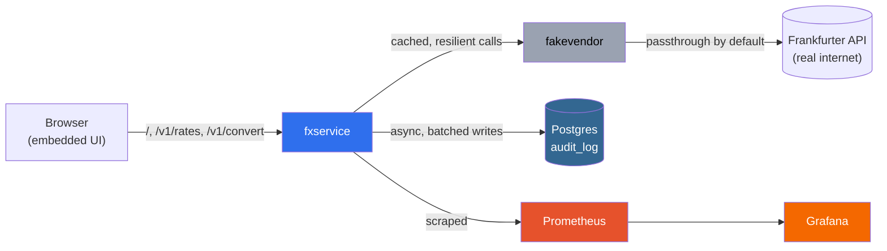

# FX Rate Service

A Go service that fronts the free [Frankfurter](https://api.frankfurter.app)
exchange rate API — get live rates and convert between currencies, with
caching, retries, a circuit breaker, Prometheus/Grafana monitoring, and
an async Postgres audit log. Built for a BNPL-style checkout use case.

## Getting started

```bash
git clone https://github.com/devopsritiks/fx-rate-service-sezzle.git
cd fx-rate-service-sezzle
docker compose up -d
```

Then open **http://localhost:8080**.

No Go toolchain, no `.env` file, and no local build needed — this pulls
pre-built images from GHCR and starts everything: the API, the UI,
Postgres, Prometheus, and Grafana.

To stop everything:

```bash
docker compose down -v
```

> **⚠️ Corporate VPN / proxy warning:** if your network runs TLS
> inspection (e.g. Zscaler), the containers won't trust its certificate
> and calls to the real exchange rate API will fail with a 502 error.
> This is a network restriction, not a bug — turn off the VPN/proxy, or
> try from a different network (home wifi, hotspot), to see live rates.
> Everything else (the UI, the resilience features, metrics, the audit
> log) still works fine either way.

## Running it

| Service | URL |
|---|---|
| **App (UI + API)** | http://localhost:8080 |
| Grafana | http://localhost:3000 |
| Prometheus | http://localhost:9091 |

### Via the UI

Open http://localhost:8080 — two forms:
- **Get rates**: enter a base currency (e.g. `USD`) and optional symbols (e.g. `CAD,EUR,GBP`), click **Get rates**.
- **Convert**: enter `from`, `to`, and an amount, click **Convert**.

### Via curl

```bash
# latest rates for USD against CAD, EUR, GBP
curl "http://localhost:8080/v1/rates/USD?symbols=CAD,EUR,GBP"

# convert 100 USD to CAD
curl "http://localhost:8080/v1/convert?from=USD&to=CAD&amount=100.00"

# health / readiness
curl http://localhost:8080/health
curl http://localhost:8080/ready
```

## What to check out on the UI

- **X-Cache badge** on every result — `HIT` (served from cache), `MISS`
  (fetched fresh), or `STALE` (vendor is down, serving the last known
  good rate).
- **Error messages rendered clearly** — try an invalid currency (e.g.
  `XX`) or a huge burst of requests, and you'll see our actual error
  codes (`INVALID_CURRENCY`, `RATE_LIMITED`, `CIRCUIT_OPEN`,
  `STALE_DATA_UNAVAILABLE`) with a plain-English explanation, not a raw
  JSON dump.
- **Footer links** to Grafana, Prometheus, `/metrics`, and `/ready` —
  jump straight into the dashboards or raw endpoints from the UI.
- **Light/dark mode** — follows your OS theme automatically.

### Using the footer links

- **Grafana** → opens http://localhost:3000, straight into the
  pre-loaded **"FX Service"** dashboard — no login needed (anonymous
  viewer access). Useful panels to watch while you use the app: request
  rate, error rate, p50/p95/p99 latency, cache hit ratio, circuit breaker
  state, vendor call latency, rate-limited requests, and the audit/Postgres
  panels. Trigger traffic from the UI or curl, then watch the graphs move.
- **Prometheus** → opens http://localhost:9091. Check **Status → Targets**
  to confirm `fxservice` is being scraped, or **Alerts** to see the 5
  alert rules (breaker open, high error rate, stale serving, high
  latency, audit write failures) and their current state.
- **`/metrics`** → the raw Prometheus text output `fxservice` exposes —
  every metric Grafana's dashboard is built from, if you want to see the
  numbers directly (e.g. search the page for `fxservice_cache_requests_total`).
- **`/ready`** → a JSON readiness check. Always returns `200`, but the
  body tells you the real state: circuit breaker status, cache size, and
  whether Postgres is reachable. Handy to refresh after breaking things
  (see below) to see the service report itself as degraded without
  actually going down.

### Checking logs

```bash
docker compose logs -f                 # all services, live-tailed
docker compose logs -f fxservice       # just the app
docker compose logs -f fakevendor      # just the vendor proxy
```

`fxservice` logs structured JSON, one line per request, including a
`request_id` that matches the `X-Request-Id` response header — useful
for tracing one specific call through the logs. Drop `-f` to print what's
there so far and exit instead of tailing live.

## Try the resilience features live

This is the actual point of the project — the API staying up while its
dependencies don't.

**Break the vendor and watch the circuit breaker trip:**

```bash
curl -X POST "http://localhost:9090/admin/mode?mode=error"

# call convert a few times — first few fail, then it fast-fails:
curl "http://localhost:8080/v1/convert?from=USD&to=CAD&amount=100"
curl "http://localhost:8080/v1/convert?from=USD&to=CAD&amount=100"
curl "http://localhost:8080/v1/convert?from=USD&to=CAD&amount=100"
curl "http://localhost:8080/v1/convert?from=USD&to=CAD&amount=100"
# -> UPSTREAM_UNAVAILABLE a few times, then CIRCUIT_OPEN instantly

curl http://localhost:8080/ready   # still 200, reports breaker: "open"

curl -X POST "http://localhost:9090/admin/mode?mode=off"   # restore
```

(`mode=slow` instead of `mode=error` simulates a vendor that's merely
slow rather than down — a different, and arguably worse, failure shape.)

**Kill Postgres and confirm the API doesn't care:**

```bash
docker compose stop postgres

curl http://localhost:8080/health   # still "ok"
curl http://localhost:8080/ready    # still 200, reports postgres: "down"
curl "http://localhost:8080/v1/convert?from=USD&to=CAD&amount=1"  # still works

docker compose start postgres       # back to normal, no restart needed
```

## Testing

```bash
go test -race ./...
go vet ./...
```

Requires a Go toolchain locally (not needed to just run the app via
Docker). CI runs the same two commands on every push and only publishes
images if both pass.

## A note on secrets

There are none. Postgres credentials default to `fx:fx` — a throwaway
local-dev value, not a real secret, visible in `docker-compose.yml`. No
API keys, tokens, or passwords are required anywhere in this project;
the only external dependency (Frankfurter) needs no authentication.

## Troubleshooting

- **Port already in use**: `docker compose up -d` will fail if something
  else is listening on 8080, 9090, 5432, 9091, or 3000. Stop whatever's
  using the port, or edit the port mappings in `docker-compose.yml`.
- **Images won't pull**: confirm you have internet access to `ghcr.io`;
  the images are public, no login required.
- **502s on every request**: see the VPN/proxy warning above.

## Features

- **Resilient by default**: retries with backoff, a circuit breaker, and
  a concurrency bulkhead protect the service (and the vendor) from
  cascading failures.
- **Caching with stale-serving**: if the vendor goes down, we serve the
  last known-good rate instead of failing outright — clearly labeled as
  stale, never silently.
- **Inbound rate limiting** so one noisy caller can't overwhelm the
  service.
- **Full observability**: Prometheus metrics and a pre-loaded Grafana
  dashboard, no setup required.
- **Async audit log**: every request is recorded to Postgres without
  slowing down the API — even if Postgres itself is down, the service
  keeps serving normally.
- **One-command run**: pre-built, multi-arch Docker images (amd64 +
  arm64) published by CI — no local build, no Go toolchain required.
- **Embedded UI**: a single static page served directly by the Go
  binary, no separate frontend container.

---

## Architecture



`fxservice` is the only service callers (or the browser) ever talk to.
It embeds the UI, calls `fakevendor` (which either passes through to the
real Frankfurter API or injects failures on demand), writes every
request to Postgres asynchronously, and exposes Prometheus metrics that
Grafana visualizes.

## Project layout

```
cmd/fxservice/                    entrypoint: wires config + server, handles SIGTERM/SIGINT
cmd/fakevendor/                   toggleable reverse proxy in front of the real vendor, for chaos/stale-cache demos
internal/config/                  env-var driven config with defaults (only package that reads os.Getenv)
internal/httpapi/                 routes, middleware (request id, logging, rate limit, metrics), handlers
internal/fxvendor/frankfurter/    Frankfurter HTTP client — ONE HTTP attempt, nothing more
internal/fxvendor/resilience/     wraps the vendor client: circuit breaker -> bulkhead -> retry
internal/fxvendor/ratescache/     wraps resilience.Client: serves fresh/stale from cache, singleflight, negative cache
internal/cache/                   Cache interface + in-memory LRU implementation (swappable for Redis later)
internal/ratelimit/               per-client-IP inbound token-bucket rate limiting middleware
internal/metrics/                 every Prometheus metric this service exports, plus hook-shaped methods
internal/audit/                   async audit log: Record, the batching Writer, pgx Sink, embedded schema
internal/money/                   decimal-safe parsing and rounding (shopspring/decimal, no float64)
internal/webui/                   embeds and serves the single-page demo UI (go:embed, no build step)
Dockerfile                        multi-stage build -> distroless/static, non-root
cmd/fakevendor/Dockerfile         same pattern for the demo proxy
.github/workflows/                CI: vet + test, then multi-arch build & push to GHCR
docker-compose.yml                default stack: pulls images from GHCR (fxservice + fakevendor + prometheus + grafana + postgres)
docker-compose.build.yml          override: build fxservice/fakevendor from local source instead of pulling
deploy/prometheus/                scrape config + alert rules (loaded directly, no Alertmanager)
deploy/grafana/                   datasource + dashboard provisioning, anonymous-viewer config
```

**Note on the vendor URL:** Frankfurter migrated its API mid-build —
`api.frankfurter.app` now 301-redirects to `api.frankfurter.dev/v1`.
Go's `http.Client` follows redirects by default so the old URL kept
"working" anyway, just paying for an invisible extra DNS+TLS+request
round trip on every vendor call. `FRANKFURTER_BASE_URL`'s default points
at the canonical URL to drop that tax. This was caught because
`httputil.ReverseProxy` (used in `cmd/fakevendor`) does *not* follow
redirects — a good reminder that a reverse proxy and a client library
can silently disagree about redirect handling.

## Endpoints

| Method | Path | Description |
|---|---|---|
| GET | `/` | Single-page demo UI (embedded) |
| GET | `/v1/rates/{base}?symbols=USD,CAD` | Latest rates for a base currency |
| GET | `/v1/convert?from=USD&to=CAD&amount=100.00` | Convert an amount between two currencies |
| GET | `/health` | Liveness probe — always 200 if the process is up |
| GET | `/ready` | Readiness probe — always 200; body reports circuit breaker state, cache stats, and Postgres reachability |
| GET | `/metrics` | Prometheus metrics |

`/v1/rates` and `/v1/convert` responses carry an `X-Cache: HIT \| MISS \|
STALE` header and `"stale"` / `"date"` / `"age_seconds"` fields in the
JSON body. Every call to these two endpoints is also recorded, async, to
the Postgres audit log.
